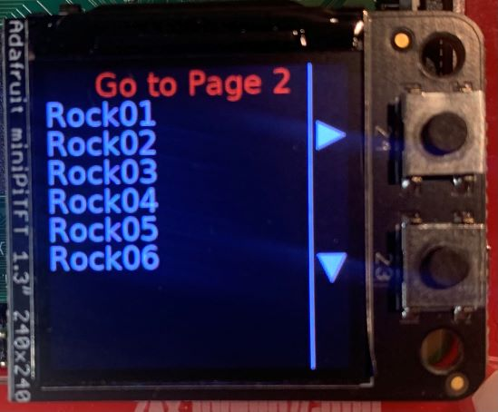

# PiLCDmenu
Simple menu system for Adafruit 1.3” LCD display.

The [Adafruit 1.3" TFT LCD](https://www.adafruit.com/product/4484) 240x240 pixel display has two buttons on it that can be accessed via the Pi's
GPIO interface. This library implements a simple, easy-to-use menu system that allows you to
have a rudimentary GUI in a tiny package.

The menu is specified using a JSON file. The menu system consists of one or more pages, each with one to nine selectable items. (TODO: Allow more than 9 items? See 'issues' for ideas.)

Each menu item is associated with an object that is passed back when that item is selected from the menu.

Here's what it looks like in action:

My initial use for this is as a front-end for selecting drum kit samples on an SR18 drum machine. :-)

Requirements
* RPi, Raspian
* LCD displaye
* Adafruit libraries: X, Y, Z
